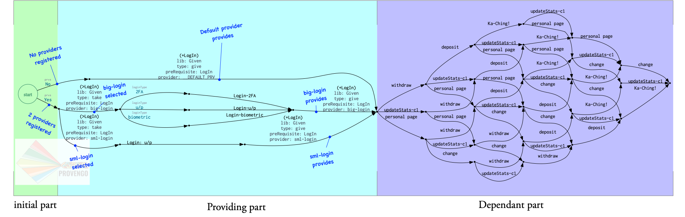

= GivenLib

Exploratory project for expressing dependencies and providing of prerequisites. Using this library, b-threads can: 

* explicitly state they assume something was already done (e.g. a login was made) 
* provide the prerequisite (e.g. preform login tests)

If a pre-requisite has no provider, a trivial default provider is auto generated for it (technically it's always generated, but it's also blocked by explicit providers, if any).

== Example

A b-thread for changing an address assumes that a login was made. If the pre-requisite was provided, the thread continues as usual. If it was not yet provided, the b-thread waits until someone provides it.

[source, javascript]
----
bthread("changeAddress", function(){
    GVN.given("LogIn");               <.>
    request(Event("personal page"));
    request(Event("change"));
});
----
<.> The b-thread may wait for someone to provide a login, or immediately continue if a login was already provided.

TIP: If a behavior depends on multiple pre-requisites, it is possible to pass a all the names or an array: `GVN.given("LogIn","HasCar","2FA Ready")`.

A `LogIn` provider. Note that the providing function must return `true` for the provisioning to "work".

[source, javascript]
----
GVN.provider("big-login").gives("LogIn", function(){    <.>
            let v = select("loginType").from("2FA", "u/p", "biometric");
            request( Event("Login-"+v) );
            return true;  <.>
        });
----
<.> Register a new provider (by name), and declare that it provides `LogIn`.
<.> The provider functions returns `true`, to signal to the Given library that the pre-requisite was provided.

NOTE: If a provider is registers to an already-provided pre-requisite, the registration is ignored.

.An analysis of a model that has parts that depend on and parts that provide a `LogIn` pre-requisite. An initial part decides whether to use default providers or not.
 