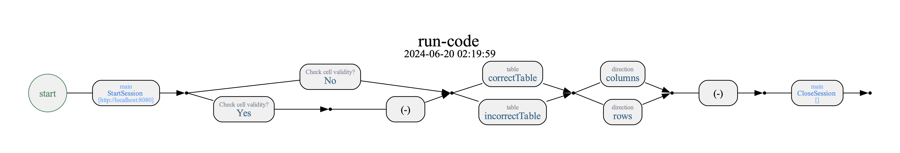

= Run Code Example

This project demos the usage of https://docs.provengo.tech/ProvengoCli/0.9.5/libraries/selenium.html#_sn_runcodecode[`runCode`],
a Selenium library command that runs code in the browser and reports back to the Provengo tool. Here we test https://content.provengo.tech/SUT-run-code.html[a page with a two tables]. Each table has a some internal logic between rows and columns (need to sum numbers on some of the cells). One table is correct, the other one contains several errors.

## Notable Files

link:SUT[]::
    The sample page we test. Also hosted https://content.provengo.tech/SUT-run-code.html[here].
link:spec/js/main.js[]::
    The main test flow. Contains browser start and stop, and events for directing which tests will happen. 
link:spec/js/run-automation.js[]::
    `runCode` automation b-threads, expand the `main` bthread above with appropriate `runCode` executions.

## General Flow
Created using `provengo analyze -f pdf`.

## Usage

1. Make sure you have a Selenium server running. The project is configured to use a local server, but you can specify another server in link:config/provengo.yml, using the `selenium.server` key.
. To run a random single scenario, use `provengo run`. If you want to see what is going on (not much here, but still), use the `--dev` flag, like so: `provengo run --dev`.
. This model is not very large, so it's easy to just generate a sample of all scenarios using `provengo sample -a full`. This will generate a samples file in `products/run-source/samples.json`.
. To run the samples, use `provengo run -s products/run-source/samples.json`.
. Finally, to see the test results, use `provengo report`.

