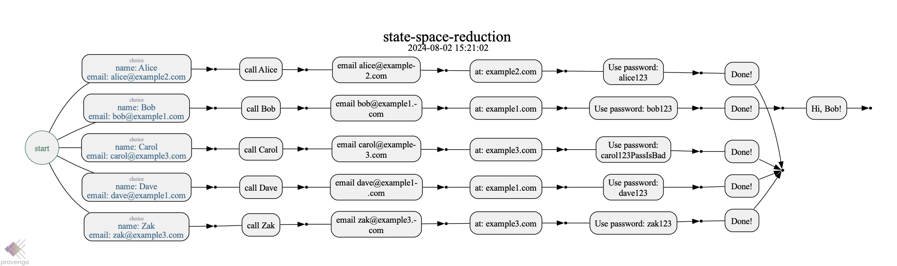
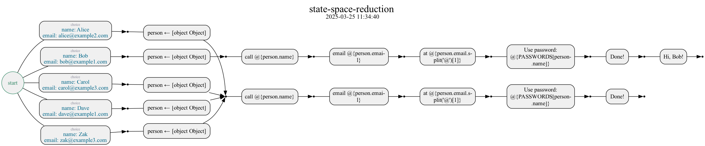

= State Space Reduction using Runtime Values

The https://docs.provengo.tech/ProvengoCli/0.9.5/libraries/runtimevars.html[Runtime Values] library can be used to make state space adhere more to the specification, while also reducing its size.

This project demonstrates the concept using two versions of the same process-based specification. In both we choose a person out of a list, and perform actions with that person (e.g. sending emails). Also, if the selected person is Bob, we say "Hi!".

Note however that while the actions are the same, the state space of the version using RTV is smaller and more descriptive of the requirements. Especially the part where Bob is treated differently from the rest of the people - all other people go on one route, whereas Bob goes on another.

.Using regular JavaScript variables
[Using regular JavaScript Variables]

.Using Provengo's Runtime Variables library
[Using regular JavaScript Variables]

== Files of Interest

link:spec/js/main-rtv.js[]::
    The main flow, using runtime values.
link:spec/js/bob-response.js[]::
    Implementing the special requirement for Bob.
link:spec/disabled/main-rtv.js[]::
    The main flow, using regular JavaScript variables. Currently disabled - move to the link:spec/js[] directory to activate.
link:spec/data/data.js[]::
    Constants used throughout the spec (people, passwords, etc).

NOTE: Bob's special behavior works with both process implementations, as it only interfaces with events that appear in both.

